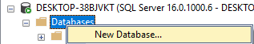
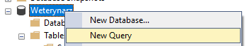
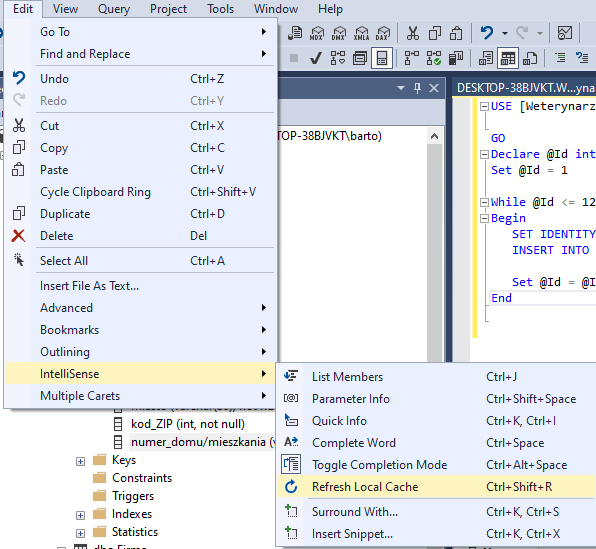

# Przygotowanie bazy do wykonania zadań

1. Tutaj jest tutorial jak zainstalować **microsoft sql server** (to dzięki czemu łączycie się za bażą). Jest fakt faktem apropo 2019 a wy pobieracie 2022, ale to jest bez różnicy. Najważniejsze, żebyście mieli **microsoft management studio 2019** bo na tym pracujemy.
[**LINK**](https://www.youtube.com/watch?v=2A5FJlVWPlU)
2. Tworzycie nową bazę danych (nazwa dowolna, ja zrobiłem Weterynarz, tylko jak nazwa będzie inna musicie zmienić nazwę po USE w pliku **fill_database.sql**
\
Wchodzicie na nowo utworzoną bazę danych, klikacie prawym, add query.\
 \
Wrzucacie tam zawartość pliku **generate_database.ddl**, odpalacie. To wam tworzy odpowiednie tablice.
3. Klikacie Edit>Intellisense>Refresh local cache

4. Generujecie nowe query, wrzucacie tam **fill_database.sql**, odpalacie, to wam zapełnia tablicę danymi. Teraz możecie pracować na tym jak tylko wam się podoba i robić tamte zadania.

## **Link do strony bleji ze wszystkimi danymi: [LINK](https://imul.math.uni.lodz.pl/~bleja/systemy_bazodanowe/)**