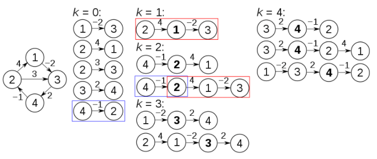
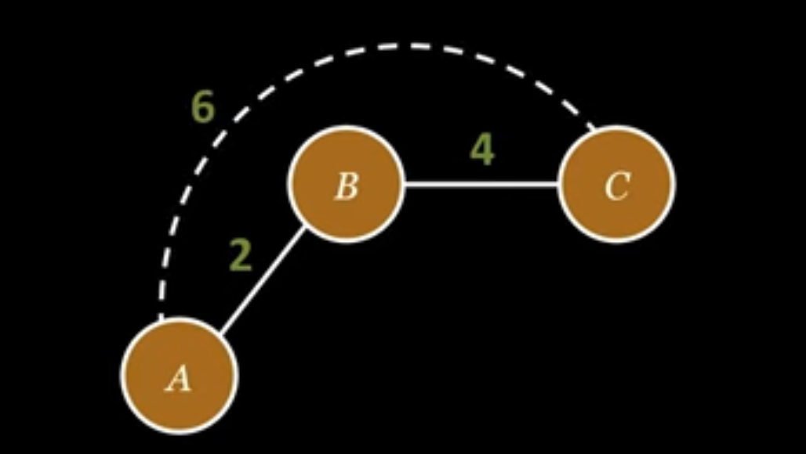

<style>
{
  font-size: 32px;
  padding: 1rem 1.5rem;
}
</style>

# Algorytm Floyda Warshalla

#### Szukanie najkrótszej ścieżki <br/> między wszystkimi wierzchołkami

Bartosz Górski

---

# Czym jest?

Algorytm Floyd'a-Warshalla to algorytm grafowy używany do znajdowania najkrótszej ścieżki między wszystkimi parami wierzchołków w grafie ważonym $G = (V,E)$.

#### Złożoności

- Złożoność czasowa - $O(V^3)$
- Złożoność pamięciowa - $O(V^2)$

Gdzie $V$ oznacza ilość krawędzi w grafie.

---

# Działanie

W algorytmie Floyda-Warshalla wykorzystujemy inna cechę struktury naj-
krótszej ściezki niz ta, ktora znalazła zastosowanie w algorytmach najkrót-
szych ściezek z mnożeniem macierzy.

W prezentowanym algorytmie bierze się pod uwagę wewnętrzne wierzchołki najkrótszej ściezki. Wewnętrznym wierzchołkiem najkrótszej ścieżki
$p = <v_1,v_2, ... ,  v_i>$ jest kazdy wierzchołek ze ścieżki $p$ różny od $v_1$, i $v_i$, tzn. każdy wierzcholek ze zbioru

$$
\lbrace v_2, v_3, ..., v,_(i-1)\rbrace
$$

---

# Działanie

Aby użyć algorytmu, musimy dostarczyć mu macierz wag o rozmairze $V*V$, gdzie $V$ oznacza ilość krawędzi w grafie. Macierz ta reprezentuje, jak sama nazwa wskazuje wagi dróg pomiędzy poszczególnymi krawędziami, gdzie **inf** oznacza brak drogi.

<style scoped>
pre {
   background-color: rgb(25, 25, 25);
   border-radius: 0.5rem;
   padding: 0.25rem;
}
</style>

```python
# Przed użyciem algorytmu       # Po użyciu algorytmu
graph = [                       graph = [
    [0,    inf, -2,  inf],              [ 0 -1 -2  0],
    [4,    0,   3,   inf],              [ 4  0  2  4],
    [inf,  inf, 0,   2  ],              [ 5  1  0  2],
    [inf,  -1,  inf, 0  ]]              [ 3 -1  1  0]]
```

---

# Przykładowy graf użyty do stworzenia macierzy wag

<style>
img[alt~="center"] {
  display: block;
  margin: 0 auto;
}
</style>



---

# Metoda wstępująca

Używając metody wstępującej, tworzymy macierz wag najkrótszych ścieżek.
Algorytm sprawdza czy używając wierzchołka pośredniego, łączna waga jaką uzyskamy przechodząc przez niego będzie mniejsza niż nie przechodząc przez niego, jeżeli tak, tablica wag najkrótszych ścieżek jest uzupełniania o to połączenie
<style>
img[alt~="center"] {
  display: block;
  margin: 0 auto;
}
</style>



---

# Pseudokod podejścia przy użyciu pętli

<style scoped>
pre {
   background-color: rgb(25, 25, 25);
   border-radius: 0.5rem;
   padding: 0.25rem;
}
</style>

```python
# Implementacja przy użyciu pętli
V = liczba wierzchołków 
distance = macierz o wielkości V * V

for k in range(V):
        for i in range(V):
            for j in range(V):
                distance[i][j] = min(distance[i][j], distance[i][k] + distance[k][j])
    print_solution(distance)
```
---

# Pseudokod podejścia przy użyciu rekurencji

<style scoped>
pre {
   background-color: rgb(25, 25, 25);
   border-radius: 0.5rem;
   padding: 0.25rem;
}
</style>

```python
# Jeżeli nie ma pośrednich krawędzi, zwróć wagę
if k == -1:
    return distance[i][j]

# Jeżeli droga przez k będzie krótsza, używamy k
else:
    return min(shortestPath(i, j, k - 1),
                shortestPath(i, k, k - 1) + shortestPath(k, j, k - 1))
```
---
# Konstruowanie najkrótszej ścieżki
Aby stworzyć najkrótszą ścieżkę, tworzymy kolejną macierz, tym razem nazywaną macierzą poprzedników. Służy ona do zapamiętywania najkrótszych ścieżek pomiędzy danymi wierzchołkami. Można stworzyć ją przy działaniu algorytmu, lub odczytywać na bieżąco przy szukaniu ścieżki. Tworzy się ją, zapisując pod danymi współrzędnymi $tab[x][y]$ wierzchołek który ma najniższą wagę między wierzchołkami $x$ i $y$. Możemy z niej potem szybko odczytać do jakiego wierzchołka powinniśmy przejść aby uzyskać najkrótszą możliwą ścieżkę

---
# Kod który służy do wyświetlania najkrótszej ścieżki
<style scoped>
pre {
   background-color: rgb(25, 25, 25);
   border-radius: 0.5rem;
   padding: 0.25rem;
}
</style>
```python
Next node graph
[[0 2 2 2]
 [0 1 0 0]
 [3 3 2 3]
 [1 1 1 3]]

if start_node == end_node:
            return []
        if self.lowests_costs[start_node][end_node] == inf:
            return []
        return_path = [start_node]
        while start_node != end_node:
            start_node = self.next_node[start_node][end_node]
            return_path.append(start_node)
        return return_path
```

---

# Domknięcie przechodnie

Domknięciem przechodnim grafu skierowanego $G = (V,E)$ nazywamy graf
$G^*=(V,E^*)$ w którym

$$
E^* = \lbrace (i,j): \text{istnieje ścieżka z wierzchołka } i \text{ do wierzchołka } j \text{ w } G  \rbrace
$$

Jednym ze sposobów na obliczenie domknięcia przechodniego grafu w czasie $O(n^3)$ jest przypisanie każdej krawędzi z $E$ wagi **1** i wykonanie algorytmu Floyda-Warshalla.

Jeżeli istnieje ścieżka z wierzchołka $i$ do wierzchołka $j$ otrzymujemy $d_{ij} < n$, w przeciwnym razie, $d_{ij} = \infin$

---

# Źródła

- [Algorytm Floyda-Warshalla - Wikipedia](https://en.wikipedia.org/wiki/Floyd%E2%80%93Warshall_algorithm)
- [Thomas H. Cormen - wprowadzenie do algorytmów](https://lucc.pl/inf/struktury_danych_i_zlozonosc_obliczeniowa/cormen_-_wprowadzenie_do_algorytmow.pdf)
